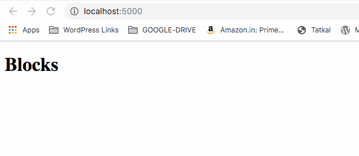
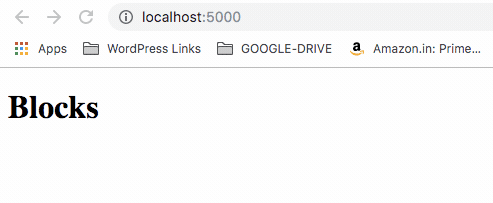

# Express App

## Description :clipboard:
> A demo app for express

## Installation :wrench:

1. Clone this repo in `git clone https://github.com/imranhsayed/express-app`
2. `git checkout branch-name`

## What are Middlewares ? :vertical_traffic_light:

> * Middlewares are functions added to the stack, that have access to the request and response object.
> * They are executed sequentially. We can do things like validation, authentication, data-parsing etc inside of each middleware.
> * When the request comes in it passes through each of the middleware, before reaching the actual route. 
> * An express application is a stack of middleware running one after the other.
> * The `next()` must be called at the end of every middleware ( function ), to move the processing to the next middleware in the stack.

## Branch Information :computer:

### 1. [static-middleware](https://github.com/imranhsayed/express-app/tree/static-middleware)

> The `express.static()` middleware that comes shipped with express, automatically servers the `index.html` on root url `'/'` without having to 
create a route using `app.get( '/' )` 

```ruby
app.use( express.static( 'public' ) )
```

### 2. [custom-middleware](https://github.com/imranhsayed/express-app/tree/custom-middleware) 
> * Creates a custom middleware called loggerMiddleWare.
> *	Run `npm run dev`
> * Open browser at `http://localhost:5000`
> * Every time you refresh the page, a GET request to `http://localhost:5000/` is made 
and the middleware intercepts that request and when the response for that request is finished
it calculates the time it took for that request to complete and prints that.

> * Also adds the message to a `log.txt` file  
  
### LoggerMiddleWare Demo :video_camera:


### 3. [query-params](https://github.com/imranhsayed/express-app/tree/query-params)

> * An example to create a route and get the post data at `/posts`
> * If the user adds a query string `?limit=2` in the route, then it should return those many post items

### Request with Query String Demo :video_camera:



### 4. [dynamic-routes](https://github.com/imranhsayed/express-app/tree/dynamic-routes)

> * An example to create a dynamic route at `/posts/:name`
> * Request to `/post/movies` will return 'I love movie blogs'
> * Request to `/post/software` will return 'I like Express'
> * Request to name that's not available in post object, like `/posts/xyz` will return 'No description found for xyz'

``` ruby
const posts = {
	'movies': 'I love movie blogs',
	'games': 'The best game of the year is God of War 4',
	'software': 'I like Express'
};

// Dynamic Route
app.get( '/posts/:name', ( req, res ) => {

	const description = posts[ req.params.name ];

	// If the value of 'name' passed in the route does not exist as posts property
	if ( ! description ) {
		res.status( 404 ).json( `No description found for ${req.params.name}` );
	} else {
		res.json( description );
	}
} );
```

### Dynamic Routes Demo :video_camera:




## Common Commands :computer:

* `npm run dev` Starts Node server at `http://localhost:5000`
