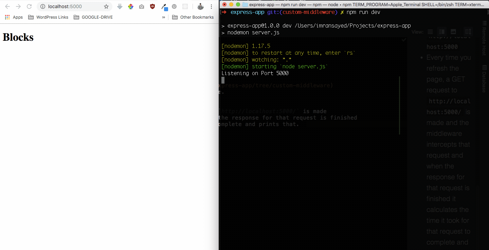

# Express App

## Description :clipboard:
> A demo app for express

## Branch Information :computer:

### 1. [custom-middleware](https://github.com/imranhsayed/express-app/tree/custom-middleware) 
> * Creates a custom middleware called loggerMiddleWare.
>  *	Run `npm run dev`
>  * Open browser at `http://localhost:5000`
>  * Every time you refresh the page, a GET request to `http://localhost:5000/` is made 
>  and the middleware intercepts that request and when the response for that request is finished
>  it calculates the time it took for that request to complete and prints that.  
  
  ### LoggerMiddleWare Demo :video_camera:
  
  
